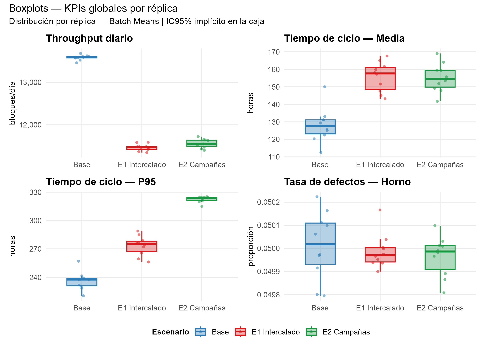
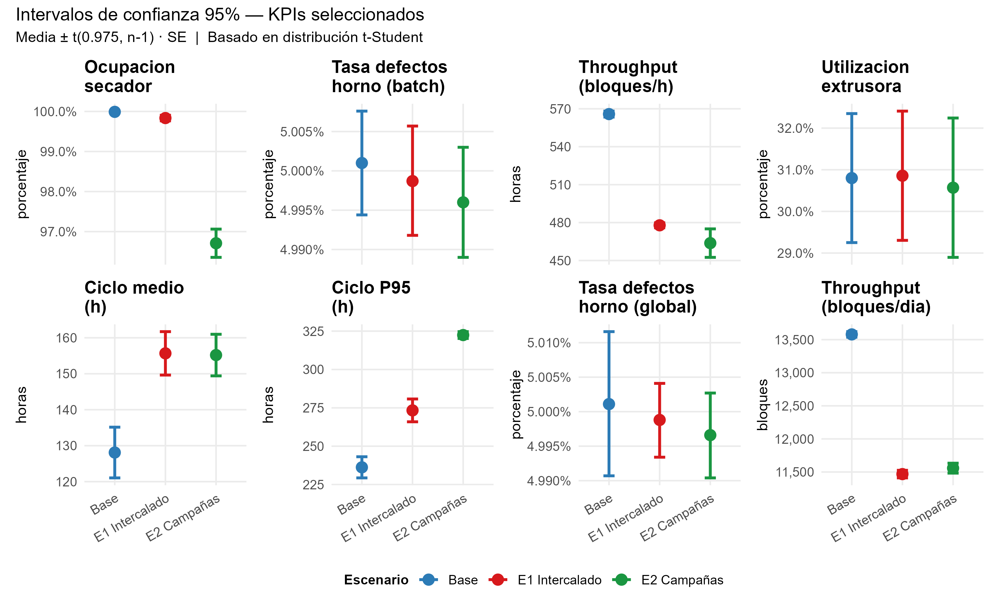
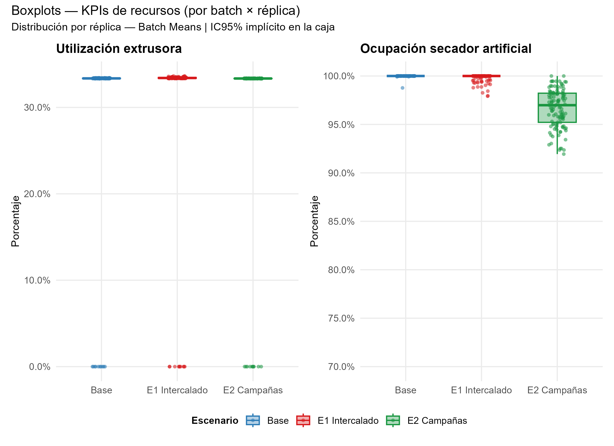
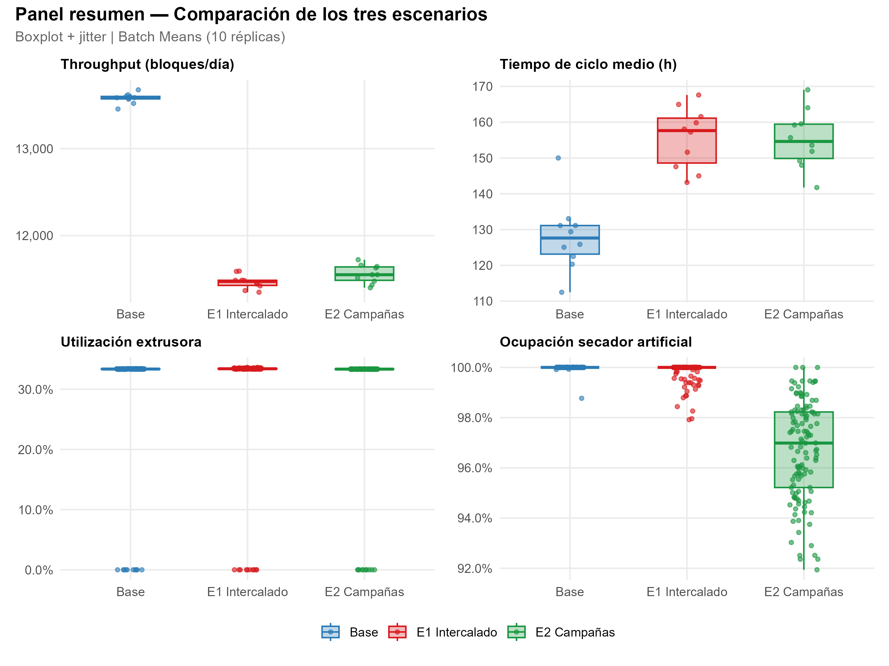
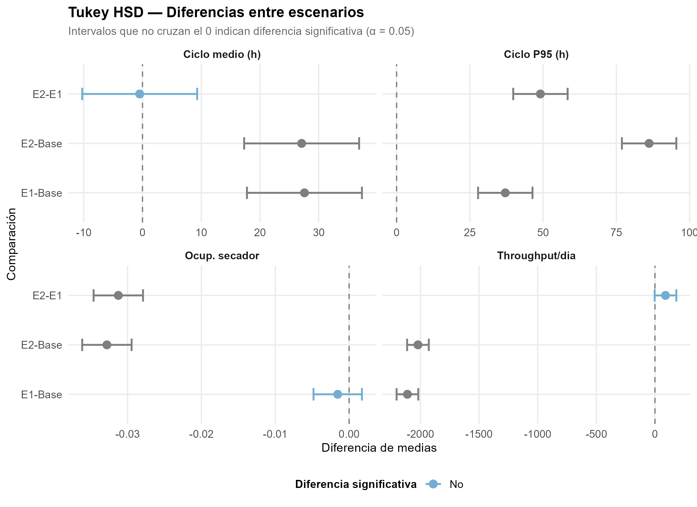
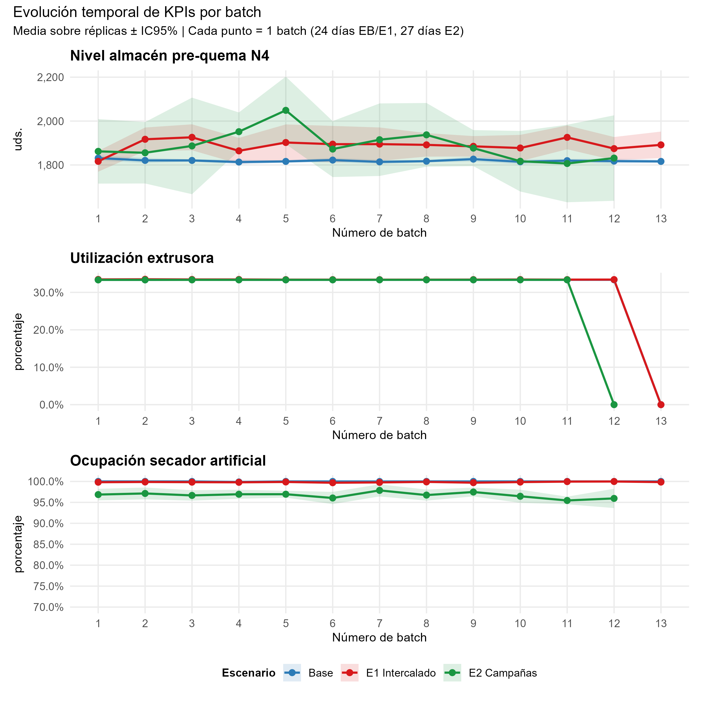
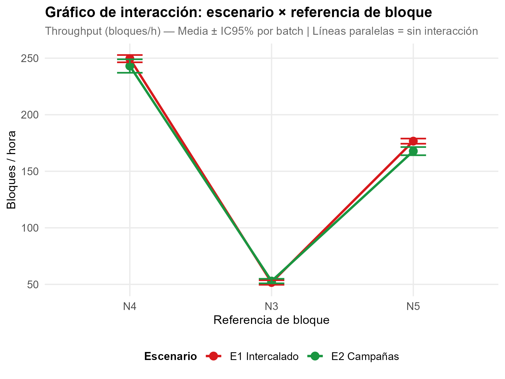

# Brick Factory Discrete-Event Simulation

**Discrete-event simulation of a brick manufacturing plant** (Ladrillera Tikal S.A.S., Colombia) built with Python/SimPy, comparing three multi-reference production strategies through rigorous statistical analysis in R.

This project is part of my undergraduate thesis in Industrial Engineering (Operations Research & Statistics) at Universidad de los Andes.

---

## Business Problem

A brick manufacturer producing a single reference (N4) wants to evaluate whether introducing two new references (N3, N5) is operationally viable — and if so, which production scheduling strategy minimizes cycle time and maximizes throughput without overloading existing resources.

**Three scenarios were modeled:**

| Scenario | Description |
|---|---|
| **EB — Base** | Single-reference production (N4 only). Current operating state. |
| **E1 — Interleaved** | All three references produced in alternating batches throughout the day. |
| **E2 — Campaigns** | Each reference produced in dedicated 27-day production campaigns. |

---

## Key Findings

- **Throughput drops ~15.5%** under multi-reference production (E1 and E2 vs. EB), confirmed by one-way ANOVA (p < 0.001).
- **E1 outperforms E2** on P95 cycle time by ~49 hours — meaning extreme delays are significantly less frequent under interleaved scheduling.
- **The artificial dryer is the system bottleneck**, not the kiln, operating at ~100% occupancy across all scenarios. Expanding kiln capacity alone would not resolve the constraint.
- No statistically significant difference between E1 and E2 on mean throughput (Tukey HSD, p > 0.05), making cycle time the deciding differentiator.

---

## Methodology

### Simulation Design
- **Engine:** Python / SimPy (discrete-event simulation)
- **Warm-up period:** 20 days, determined via the Welch moving-average method
- **Horizon:** 312 days of effective simulation per run
- **Output method:** Batch Means (13 batches × 24 days for EB/E1; 12 batches × 27 days for E2)
- **Replications:** 10 independent runs per scenario using fixed seeds for reproducibility

### Statistical Analysis (R)
- Descriptive statistics and 95% confidence intervals (t-Student)
- Shapiro-Wilk normality test and Levene's test for homoscedasticity
- One-way ANOVA + Tukey HSD post-hoc for all key KPIs
- Two-way ANOVA (scenario × reference) for E1 vs. E2 throughput breakdown
- Lag-1 autocorrelation heatmap to validate batch independence

### Key KPIs Tracked
- Daily throughput (blocks/day)
- Cycle time — mean and P95 (hours)
- Extruder utilization and artificial dryer occupancy (fraction)
- Defect rates by stage (extrusion, artificial drying, kiln)
- Pre-kiln inventory level by reference

---

## Results

### Throughput and Cycle Time
EB sustains the highest throughput. Both E1 and E2 show comparable mean throughput, but E1 significantly reduces tail-end cycle times (P95).




### Resource Utilization
The artificial dryer reaches near-100% occupancy in all scenarios, confirming it as the binding constraint. Extruder utilization remains well below capacity.



### Scenario Comparison — Summary Panel
Side-by-side view of the four most decision-relevant KPIs.



### Tukey HSD — Pairwise Comparisons
Statistically significant differences between pairs of scenarios by KPI. Intervals not crossing zero indicate significance at α = 0.05.



### Temporal Evolution by Batch
Stability of KPIs across batches validates the warm-up exclusion and batch independence assumption.



### Interaction Plot — E1 vs. E2 by Reference
Two-way ANOVA interaction plot for throughput broken down by brick reference (N3, N4, N5).



---

## Repository Structure

```
brick-factory-des/
│
├── simulation/
│   ├── simulation_base.py            # EB: single-reference baseline
│   ├── simulation_e1_interleaved.py  # E1: interleaved multi-reference
│   └── simulation_e2_campaigns.py    # E2: campaign-based multi-reference
│
├── analysis/
│   ├── analysis_warmup_welch.R       # Warm-up period determination (Welch method)
│   ├── analysis_validation.R         # Model validation: simulated vs. real data
│   └── analysis_batch_means.R        # Full statistical analysis pipeline
│
├── figures/                          # Output plots (generated by analysis_batch_means.R)
│
├── data/                             # Batch means CSV outputs from Python simulations
│                                     # (create this folder locally and place CSVs here before running R)
│
└── README.md
```

---

## How to Run

### 1. Run the simulations

Each script is self-contained. Run from the `simulation/` directory:

```bash
python simulation_base.py
python simulation_e1_interleaved.py
python simulation_e2_campaigns.py
```

Each script generates a `resultados_batch_means/` folder with `EB_batches.csv`, `EB_globales.csv`, etc. Move these CSVs to the `data/` folder before running the R analysis.

**Dependencies:** `simpy`, `numpy`, `pandas`, `scipy`

```bash
pip install simpy numpy pandas scipy
```

### 2. Run the statistical analysis

Open R and set `DIR_DATOS` at the top of `analysis_batch_means.R` to point to your `data/` folder. Then source the script:

```r
source("analysis/analysis_batch_means.R")
```

This generates all figures (saved to `figures/`) and summary tables.

**R packages required:** `tidyverse`, `broom`, `car`, `rstatix`, `scales`, `patchwork`

---

## Tech Stack

| Tool | Purpose |
|---|---|
| Python 3 / SimPy | Discrete-event simulation engine |
| NumPy / SciPy | Stochastic distributions (Gamma, Weibull, bimodal normal mixture via MClust) |
| R / ggplot2 | Statistical analysis and visualization |
| tidyverse | Data wrangling pipeline |
| car / rstatix | ANOVA, Levene, Shapiro-Wilk |
| patchwork | Multi-panel figure composition |

> **Language note:** all simulation and analysis code is written in Spanish (variable names, comments, and output labels), reflecting the language of the original thesis. Key concepts are explained in English in this README.


